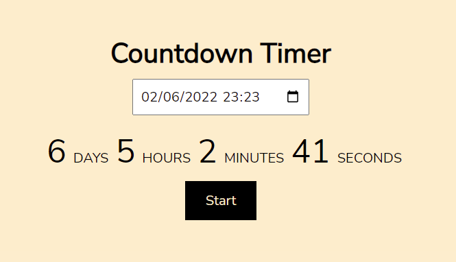

# Countdown-Timer
Temporizador de eventos, feito para o desafio do [AppIdeas](https://github.com/florinpop17/app-ideas). Veja uma [demo aqui](https://codepen.io/gustavoaqm/pen/ExQoJoz).

Todos nós temos eventos importantes que esperamos na vida, aniversários,
aniversários e feriados para citar alguns. Não seria bom ter um aplicativo
que conta os meses, dias, horas, minutos e segundos para um evento?
Countdown Timer é apenas esse app!

O objetivo do Countdown Timer é fornecer uma
exibição dos meses, dias, horas, minutos e segundos para um usuário inserido
evento.
